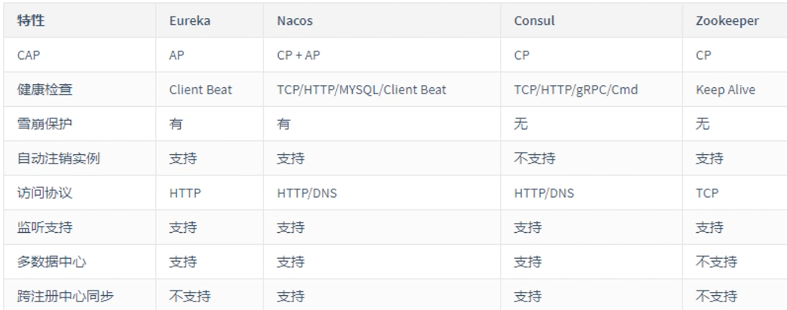
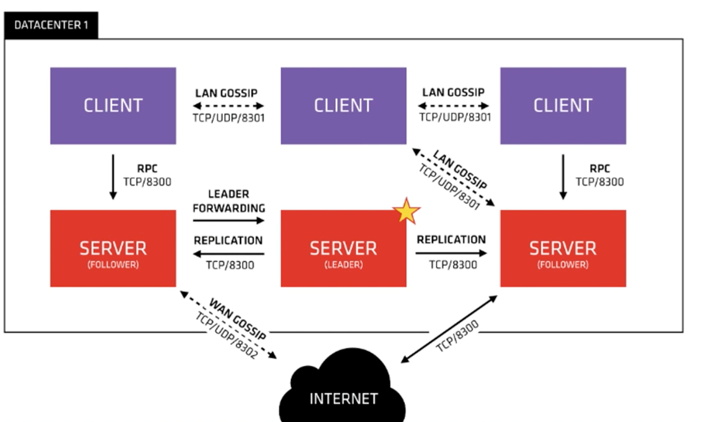

## learn-consul

Learn then [consul](https://www.consul.io/) with [Go](https://go.dev).

## 常见的注册中心

- Netflix Eureka
- Alibaba Nacos
- HashiCore Consul
- Apache Zookeeper
- CoreOS Etcd
- CNCF CoreDNS



## Consul 角色

- 客户端(`client`)：无状态，将 HTTP 和 DNS 接口请求转发给局域网内的服务端集群。
- 服务端(`server`)：保存配置信息，高可用集群，每个数据中心的 server 数量推荐为 3 个或 5 个
- 代理(`agent`)：客户端和服务端统称为 `agent`



## 安装 Consul

```bash
wget -O- https://apt.releases.hashicorp.com/gpg | gpg --dearmor |  tee /usr/share/keyrings/hashicorp-archive-keyring.gpg && \
echo "deb [signed-by=/usr/share/keyrings/hashicorp-archive-keyring.gpg] https://apt.releases.hashicorp.com $(lsb_release -cs) main" | tee /etc/apt/sources.list.d/hashicorp.list && \
apt update -y && apt install consul -y && \
consul version
```

## 开发模型

### ipv4

```bash
consul agent -dev -client=0.0.0.0
```

### ipv6

```bash
consul agent -dev -client=[::]
```

### 访问 web

- `http://ipv4:8500` 或
- `http://[ipv6]:8500`

## 将 consul 集成到 go

```bash
go get -u github.com/hashicorp/consul/api
```

## 集群

- Server 通常奇数

- 后续扩展通常增加 Client 即可

### 启动服务端（以 3 个节点为例）

> 每个服务端节点执行下面的命令

```bash
# 节点名称
NODE_NAME="server-01" && \
# 数据保存目录
DATA_DIR="/var/consul/data/${NODE_NAME}" && \
# 集群中节点数量
BOOTSTRAP_EXPECT=3 && \
mkdir -p $DATA_DIR && \
consul agent -server \
	-bind=[::] \
	-client=[::] -ui\
	-bootstrap-expect=$BOOTSTRAP_EXPECT \
	-data-dir=$DATA_DIR \
	-node=$NODE_NAME
```

### 启动客户端

> 每个客户端执行下面的命令

```bash
# 节点名称
NODE_NAME="client-02" && \
# 数据保存目录
DATA_DIR="/var/consul/data/${NODE_NAME}" && \
mkdir -p $DATA_DIR && \
consul agent \
	-client=[::] \
	-bind=[::] \
	-data-dir=$DATA_DIR \
	-node=$NODE_NAME
```

### 加入集群

- 除了主节点外，其它服务端节点和客户端节点都需要执行本操作

- 参数即为主节点的地址

```bash
consul join '[主节点IPV6地址]'
```

或

```bash
consul join '主节点IPV4地址'
```

### 查询节点

> 任意服务端和客户端节点都可执行

```bash
consul members
```

```
$ consul members
Node       Address                                  Status  Type    Build   Protocol  DC   Partition  Segment
server-01  [2a:**:**:0b]:8301            alive   server  1.13.2  2         dc1  default    <all>
server-02  [2a:**:**:d9]:8301            alive   server  1.13.2  2         dc1  default    <all>
server-03  [2a:**:**:70]:8301            alive   server  1.13.2  2         dc1  default    <all>
client-01  [2a:**:**:3e]:8301            alive   client  1.13.2  2         dc1  default    <default>
client-02  [20:**:**7:1]:8301  alive   client  1.13.2  2         dc1  default    <default>
```

## API

> [官方文档](https://www.consul.io/api-docs)

### 服务注册

> [官方文档](https://www.consul.io/api-docs/agent/service#register-service)

```bash
 curl -X PUT 'http://[::1]:8500/v1/agent/service/register' -H 'content-type:application/json' -d '{"Name":"learn-consul-1","ID":"learn-consul-1","Address":"[20:*:01]","Port":54321}'
```

### 取消注册

> https://www.consul.io/api-docs/agent/service#deregister-service

```bash
curl -X PUT 'http://[::1]:8500/v1/agent/service/deregister/learn-consul-1' -H 'content-type:application/json'
```

### 服务列表

> https://www.consul.io/api-docs/agent/service#list-services

```bash
curl -X GET 'http://[::1]:8500/v1/agent/services' -H 'content-type:application/json'
```

### 过滤服务

> https://www.consul.io/api-docs/agent/service#filtering

### 健康检查

> https://www.consul.io/api-docs/agent/check
